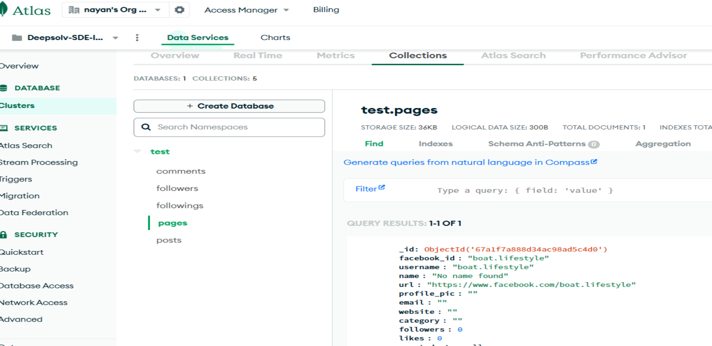
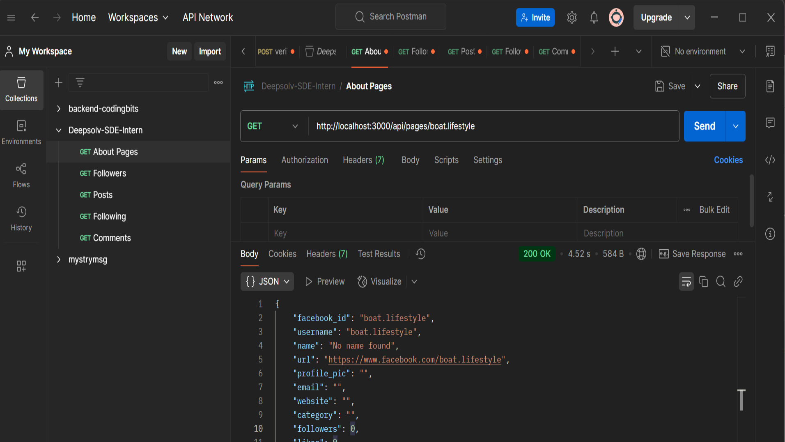

# Deepsolv-SDE-Intern-Assignment

# Facebook Insights Microservice

Facebook Insights service scrapes the details of a given Facebook Page (username), stores the information in a database, and provides a set of APIs for retrieving the scraped data. The service uses Node.js with Puppeteer for web scraping, MongoDB for storing data, and Express.js to expose APIs.

## Features

- Scrapes Facebook Page details, including:
  - Page name, URL, Facebook ID, profile picture, email, website, category, followers count, likes count, and page creation date.
  - Top 25-40 posts, including comments, followers, and following.
- Stores scraped data in MongoDB with proper relationships maintained.
- Exposes APIs to fetch page details from the database and allows filtering by follower count, name, and category.
- Pagination support for GET requests to handle large data efficiently.
- Provides Postman Collection for API testing and presentation.

## Architecture

### 1. **Scraper Service (scraperService.js)**

The scraper service is responsible for scraping Facebook Page details using Puppeteer. It uses selectors to gather information like:
- Basic page information (name, followers, likes, etc.).
- Posts, comments, followers, and following of the page.
- Stores all the scraped data in MongoDB.

### 2. **Database (MongoDB)**

The scraped data is stored in MongoDB. The following collections are used:
- **Pages**: Stores the basic details of the Facebook page.
- **Posts**: Stores the posts for each page, including comments.
- **Followers/Following**: Stores information about the followers and the following list for the page.

### 3. **API Layer (Express.js)**

The Express.js server exposes multiple GET endpoints:
- **GET /page/:username**: Fetch details of the page. If the page is not available in the database, it will scrape the data in real-time.
- **GET /pages**: Fetch pages based on filters (follower count range, name, and category).
- **GET /page/:username/followers**: Fetch the followers of a given page.
- **GET /page/:username/following**: Fetch the following of a given page.
- **GET /page/:username/posts**: Fetch the recent 10-15 posts of a page.
- **GET /page/:username/posts/:postId/comments**: Fetch the comments for a particular post.

### 4. **Pagination**

Pagination is applied to APIs that might return large amounts of data, such as lists of followers, posts, etc.

---

### 5. **Result**






#### Postman Collection JSON File

```json
{
	"item": [
		{
			"name": "About Pages",
			"request": {
				"method": "GET",
				"header": []
			},
			"response": []
		},
		{
			"name": "Followers",
			"request": {
				"method": "GET",
				"header": []
			},
			"response": []
		},
		{
			"name": "Posts",
			"request": {
				"method": "GET",
				"header": []
			},
			"response": []
		},
		{
			"name": "Following",
			"request": {
				"method": "GET",
				"header": []
			},
			"response": []
		},
		{
			"name": "Comments",
			"request": {
				"method": "GET",
				"header": []
			},
			"response": []
		}
	]
}

```

## Prerequisites

- Node.js (v16 or higher)
- MongoDB (locally or on a cloud service like MongoDB Atlas)
- Puppeteer (for scraping)

## Installation

### Step 1: Clone the Repository

```bash

git clone https://github.com/your-repository/facebook-page-scraper.git

cd src

npm install

```


